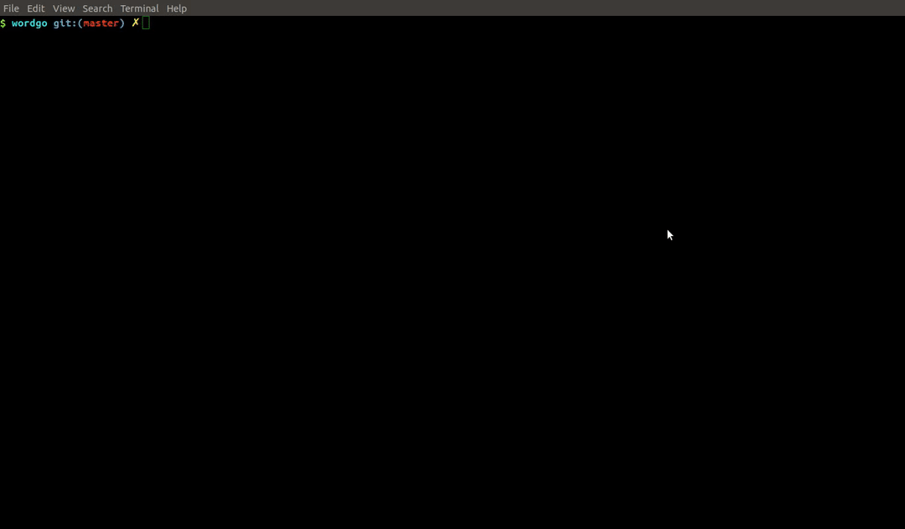

# wordgo  




Wordgo is a cross platform desktop application (English to Bengali dictionary by default) written using Go QML binding. The app uses [gotri](https://github.com/monirz/gotri) for loading the words in the Trie/Prefix tree  and [therecipe/qt](https://github.com/therecipe/qt) a QT Go binding library for making the UI. 

For using it with different language you will need to replace the dictionary.txt file with the word-list of your language.    

This dictionary file has 135000 English word with multiple Bangla word menaing. Feel free to add any correction or add a new word to it. Also if you are good at QML and think you can improve the UI, don't hesitate, just jump into it. 

### Usage/Install  

Check out the binary file in the release section and download the file for your specific platform.   
For **Debian** based distro there is a debian package file in the release, just download [this](https://github.com/monirz/wordgo/releases/download/1.0.1/wordgo_1.0-1.deb) and run the command

```
$ sudo dpkg -i wordgo_1.0-1.deb
$ wordgo
```

The latest binary file might be found in the **deploy** directory with the platform name.   
Run it from the root directory of the project.

```
$ ./deploy/linux/wordgo 
``` 

**Note:** 
If you run the `wordgo` executable file directly, you will need to have the dictionary.txt file in the same directory.   

## Build 
To install the dependency follow the [therecipe/qt](https://github.com/therecipe/qt) instruction for compiling QT application.  

```
$ make build 
```

The compiled binary file will be in the deploy/your-platform directory    
** compiling for Windows on Linux  ** 

```
$ make linux-to-windows 
```

## Contributing

1. Fork it
2. Create your feature branch (`git checkout -b my-new-feature`)
3. Make changes and add them (`git add .`)
4. Commit your changes (`git commit -m 'Added some feature'`)
5. Push to the branch (`git push origin my-new-feature`)
6. Create new pull request 

## Credit 

The word-list is generated based on Ankur.org's Bangla-English [dictionary database](http://www.bengalinux.org/english-to-bengali-dictionary/about.htm.    


 